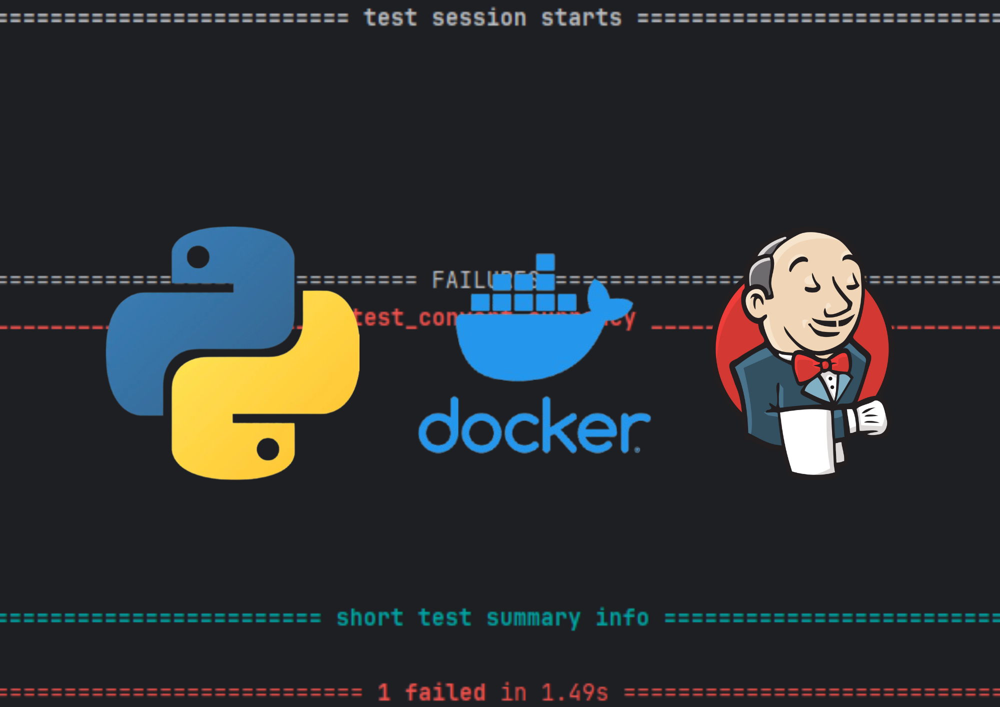

<h3 align="center">
        <samp>&gt; Integration Continue
        </samp>
</h3>


<p align="center"> 
  <samp>
    <br>
    「 <b>B3 - EPSI Dev FS</b> 」
    <br>
  </samp>
</p>

<br/>




# - Use To Code -


<br/>

# - Objectifs - </center>

## Mettre en place un pipeline d'intégration continue pour un projet logiciel

<br/>

# - Architecture du projet -

```php
├── venv/
│   └── ...
├── app.py
├── Dockerfile
├── Jenkinsfile
├── README.md
├── requirements.txt
└── test_app.py
```

<br/>

# - Concepts Clés-

## - Pourquoi Docker ?

+ Isolation : Chaque application s'exécute dans son propre environnement, sans interférer avec d'autres applications.
+ Portabilité : Un conteneur peut fonctionner de manière identique sur différentes machines, garantissant un comportement constant.
+ Facilité de déploiement : Docker facilite l'intégration et le déploiement d'applications grâce aux images Docker.


## - Pourquoi Jenkins ?

+ Automatisation : Jenkins automatise les étapes de build, test et déploiement, réduisant ainsi le risque d’erreurs humaines.
+ Intégration continue (CI) : Jenkins permet de détecter les erreurs rapidement en exécutant des tests sur chaque modification du code.
+ Déploiement continu (CD) : Jenkins peut automatiser le déploiement de nouvelles versions d'applications.


## - Pourquoi un pipeline CI/CD ?

+ Efficacité : En automatisant les processus de construction, de test et de déploiement, les développeurs peuvent livrer des fonctionnalités plus rapidement.
+ Qualité du code : Les tests automatisés détectent les erreurs rapidement, améliorant la stabilité du code.
+ Feedback rapide : Les développeurs reçoivent des retours immédiats sur l’intégrité de leur code à chaque changement, ce qui permet une correction rapide des problèmes.

<br/>

# - Installation -

## 1. Prérequis : Installer Docker et Git

## 2. Cloner le Projet depuis GitHub
```
git clone https://github.com/Feareis/b3-epsidevfs-integration_continue.git
cd b3-epsidevfs-integration_continue
```

## 3. Construire l’Image Docker
```
docker build -t currency_converter:1.0 .
```

## 4. Exécuter l’Application Dockerisée
```
docker run -p 5000:5000 currency_converter:1.0
```

## 5. Configurer Jenkins (si nécessaire)

Installer Jenkins : Installe Jenkins (par exemple, avec Docker).
<br/><br/>
Configurer le pipeline : 
+ Crée un nouveau job Jenkins et relie-le au dépôt GitHub b3-epsidevfs-integration_continue.
+ Si un Jenkinsfile est déjà présent dans le dépôt, Jenkins exécutera automatiquement le pipeline (build, tests, déploiement).